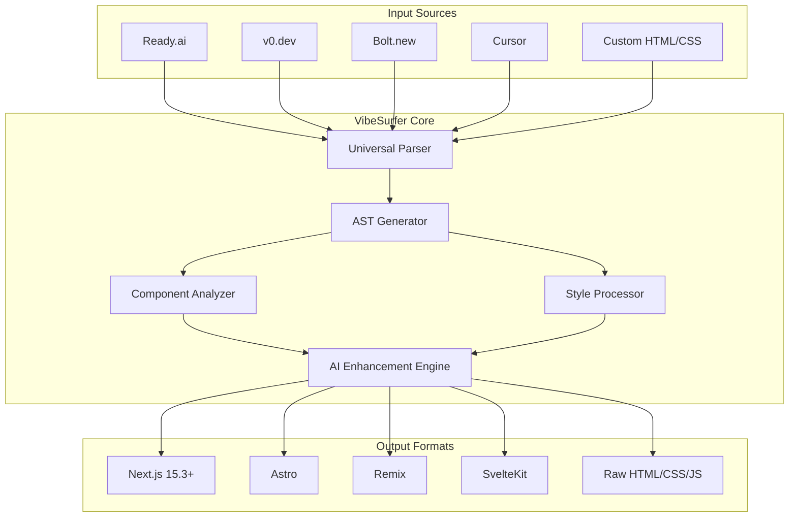

# VibeSurfer プロダクトビジョン

## 🌊 概要

VibeSurferは、様々なコード生成ツール（Ready.ai, v0, Bolt, Cursor等）間の相互運用性を実現する革新的なプラットフォームです。

## 🎯 コアバリュー

### 1. **Universal Import/Export**
どんなコード生成ツールの出力も取り込み、任意の形式で出力

### 2. **Intelligent Conversion**
AIを活用した賢い変換で、デザインの意図を保持

### 3. **Version Control Integration**
Gitと深く統合し、デザインの履歴管理を実現

## 🏗️ アーキテクチャ案

## 💡 主要機能

### Phase 1: MVP (3ヶ月)
1. **Ready.ai → Astro/Next.js変換**
   - 現在のAgileTechサイトで実証済み
   - コンポーネント自動分割
   - スタイル最適化

2. **基本的なWeb UI**
   - URLまたはファイルアップロード
   - リアルタイムプレビュー
   - エクスポートオプション

3. **Git統合**
   - 自動コミット生成
   - 変更履歴追跡

### Phase 2: 拡張 (6ヶ月)
1. **マルチソース対応**
   - v0.dev統合
   - Bolt.new統合
   - Figmaプラグイン

2. **AI強化機能**
   - コンポーネント命名提案
   - アクセシビリティ改善
   - パフォーマンス最適化

3. **チーム機能**
   - コラボレーション
   - コメント・レビュー
   - 承認ワークフロー

### Phase 3: エンタープライズ (12ヶ月)
1. **カスタムワークフロー**
   - 企業独自の変換ルール
   - プライベートテンプレート
   - CI/CD統合

2. **高度な分析**
   - デザインシステム準拠チェック
   - コード品質メトリクス
   - 使用統計ダッシュボード

## 🛠️ 技術スタック案

### フロントエンド
- **Framework**: Next.js 15.3+ (App Router)
- **UI**: Radix UI + Tailwind CSS
- **State**: Zustand
- **リアルタイムプレビュー**: Sandpack

### バックエンド
- **API**: Hono on Cloudflare Workers
- **Parser**: 各ツール専用パーサー
- **Storage**: R2 (コード履歴)
- **Database**: D1 (メタデータ)
- **Queue**: Cloudflare Queues

### AI/ML
- **LLM**: Claude API (コード理解・生成)
- **Vision**: GPT-4V (デザイン解析)
- **Embeddings**: OpenAI (類似検索)

## 💰 ビジネスモデル

### Freemium
- **無料**: 月10変換まで
- **Pro**: $29/月 - 無制限変換、Git統合
- **Team**: $99/月 - チーム機能、優先サポート
- **Enterprise**: カスタム価格 - SLA、専用インスタンス

## 🚀 Go-to-Market戦略

1. **Developer Community**
   - Product Hunt ローンチ
   - Dev.to / Hashnode 記事
   - YouTube デモ動画

2. **Integration Partners**
   - Vercel / Netlify 統合
   - VS Code 拡張機能
   - GitHub Marketplace

3. **Content Marketing**
   - 変換レシピ集
   - ベストプラクティスガイド
   - ケーススタディ

## 📊 成功指標

- **月間アクティブ変換数**: 10,000+ (6ヶ月後)
- **有料転換率**: 5%+
- **NPS**: 50+
- **MRR**: $50,000+ (12ヶ月後)

## 🔮 将来の展望

VibeSurferは単なる変換ツールを超えて、デザインとコードの架け橋となる「Design-to-Code OS」を目指します。AIの進化と共に、より賢く、より速く、より美しいWebアプリケーション開発を実現します。

---

**ドメイン**: vibesurfer.work  
**開発開始**: 2025年Q1  
**MVP リリース**: 2025年Q2予定